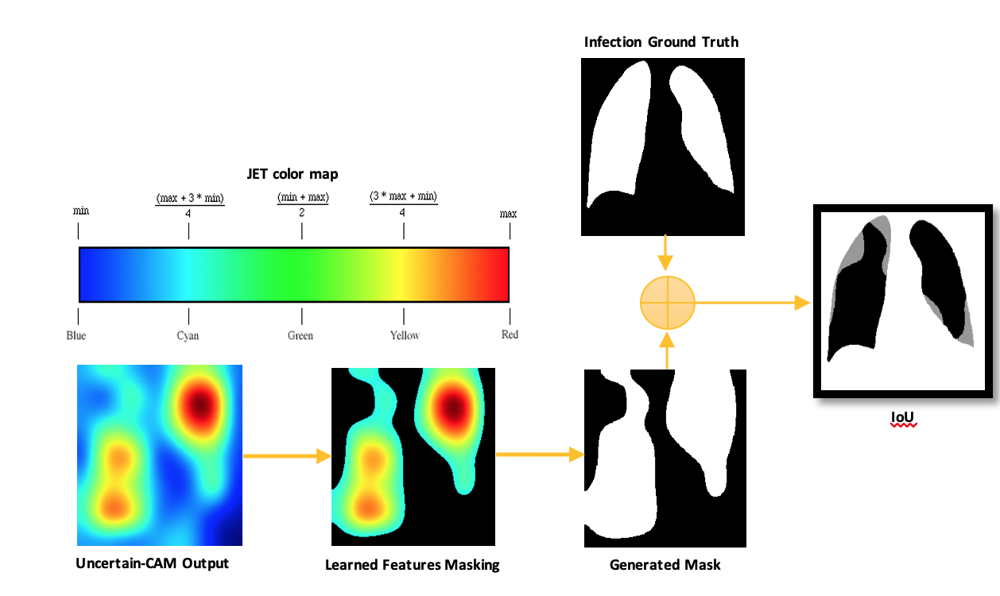

# About

:fuelpump: **will be updated soon**

Materials to reproduce the results of the paper submitted to [Journal](https://www.l): 

*[Uncertain-CAM: Uncertainty Based Ensemble Machine Voting for Improved COVID-19 CXR Classification and Explainability](https://www.)*

****



## Data
Put your data under **data** folder and follow instructions in **read.txt**

Data available on [kaggle](https://www.kaggle.com/datasets/anasmohammedtahir/covidqu):


## Installation
```
git clone https://github.com/waleed-aldhahi/uncertain-cam.git
cd uncertain-cam
pip install -r requirements.txt  # pip install -e .
python run.py
```
## Or
```
pip install git+https://github.com/waleed-aldhahi/uncertain-cam.git
```
## Run 
```
python run.py
```

## Citation

BibTeX entry:
```
@article{WaleedAldhahi2022,
author = {Aldhahi, Waleed and Sull, Sanghoon},
doi = {},
issn = {},
journal = {Journal},
pages = {},
title = {{Uncertain-CAM: Uncertainty Based Ensemble Machine Voting for Improved COVID-19 CXR Classification and Explainability}},
volume = {},
year = {2022},
}
```
